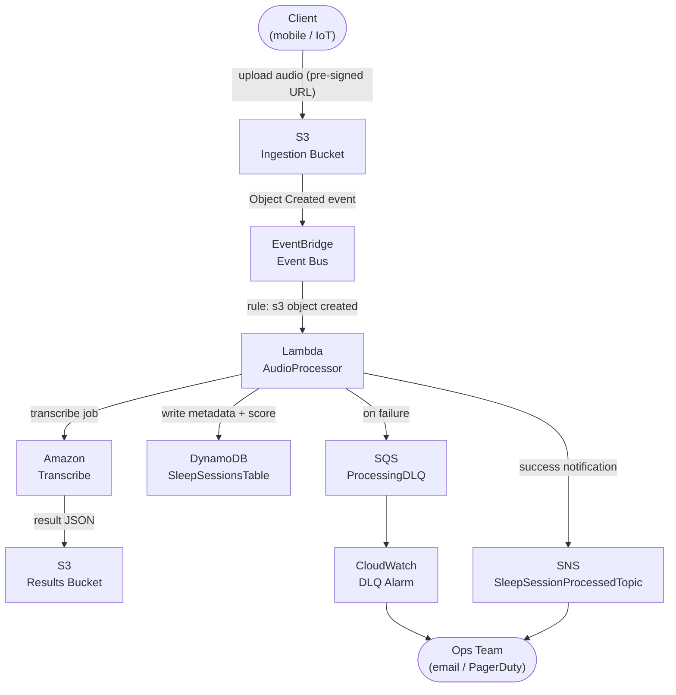

# Architecture: Sleep Audio Pipeline

## Overview

The **cdk-sleep-go-copilot** project implements a fully serverless, event-driven pipeline on AWS that ingests raw sleep-session audio files, processes them (transcription, analysis, tagging), and delivers enriched results to downstream consumers.

---

## Pipeline Description

### 1. Ingestion

A client (mobile app, IoT device, or web app) uploads a raw audio file (`.wav` / `.mp3`) to the **Ingestion S3 Bucket** (`SleepAudioIngestionBucket`). Public access is blocked; uploads are authenticated via pre-signed URLs or Cognito Identity Pools.

### 2. Event Routing (EventBridge)

An **S3 Event Notification** publishes an `Object Created` event to the default **Amazon EventBridge** event bus. An EventBridge rule matches events with the pattern `source: aws.s3 / detail-type: Object Created` and forwards them to the processing targets.

### 3. Processing

An **AWS Lambda** function (`AudioProcessorFunction`) is triggered by the EventBridge rule. It performs:
- Audio format validation and normalisation.
- Invocation of **Amazon Transcribe** for speech-to-text conversion.
- Basic metadata extraction (duration, sample rate, upload timestamp).
- Sleep-quality scoring (placeholder logic in v1).

### 4. Storage

Processed results are persisted in two places:
- **Results S3 Bucket** (`SleepAudioResultsBucket`) – stores the raw Transcribe output JSON.
- **Amazon DynamoDB** table (`SleepSessionsTable`) – stores structured session metadata and scores (partition key: `sessionId`, sort key: `timestamp`).

### 5. Notification

On successful processing, the Lambda publishes a message to an **Amazon SNS** topic (`SleepSessionProcessedTopic`). Downstream consumers (e.g., email digest Lambda, mobile push notification) subscribe to this topic.

### 6. Error Handling

Failed Lambda invocations are routed to an **SQS Dead-Letter Queue** (`ProcessingDLQ`). A CloudWatch Alarm monitors the DLQ depth and fires an SNS alert to the operations team.

---

## Component Inventory

| Component | AWS Service | CDK Construct Level |
|---|---|---|
| `SleepAudioIngestionBucket` | S3 | L2 (`s3.Bucket`) |
| `SleepAudioResultsBucket` | S3 | L2 (`s3.Bucket`) |
| EventBridge rule | EventBridge | L2 (`events.Rule`) |
| `AudioProcessorFunction` | Lambda | L2 (`lambda.Function`) |
| `SleepSessionsTable` | DynamoDB | L2 (`dynamodb.Table`) |
| `SleepSessionProcessedTopic` | SNS | L2 (`sns.Topic`) |
| `ProcessingDLQ` | SQS | L2 (`sqs.Queue`) |

---

## Mermaid Diagram

---

## AWS Well-Architected Alignment

| Pillar | Design Decision |
|---|---|
| Operational Excellence | CI enforces `go test` + `cdk synth` on every commit. |
| Security | S3 buckets block public access; Lambda uses least-privilege IAM roles. |
| Reliability | SQS DLQ + CloudWatch Alarm ensures no events are silently lost. |
| Performance Efficiency | Serverless Lambda auto-scales to ingestion rate. |
| Cost Optimisation | Pay-per-invocation model; no always-on compute. |
| Sustainability | Minimal resource provisioning; event-driven activation only. |

---

> **Note:** Keep this document and its Mermaid diagram in sync with every infrastructure change. The CI pipeline will reject PRs where ARCHITECTURE.md diverges from the deployed constructs.
