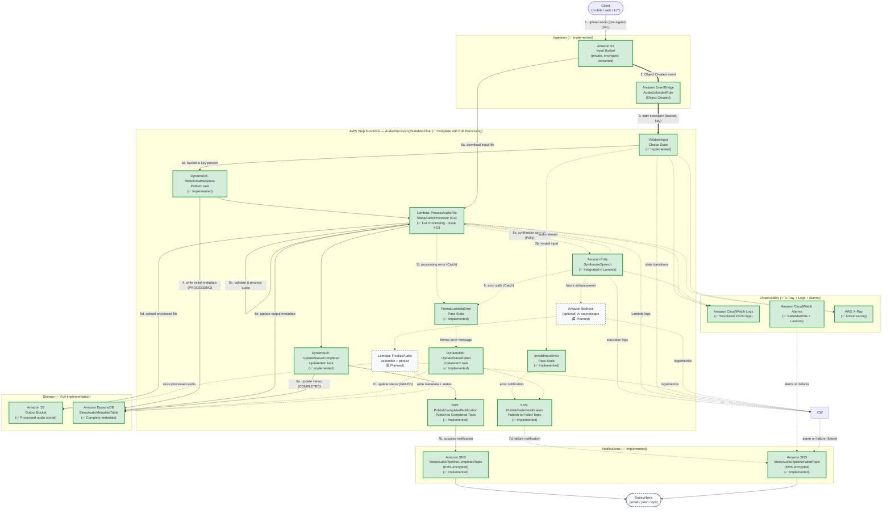
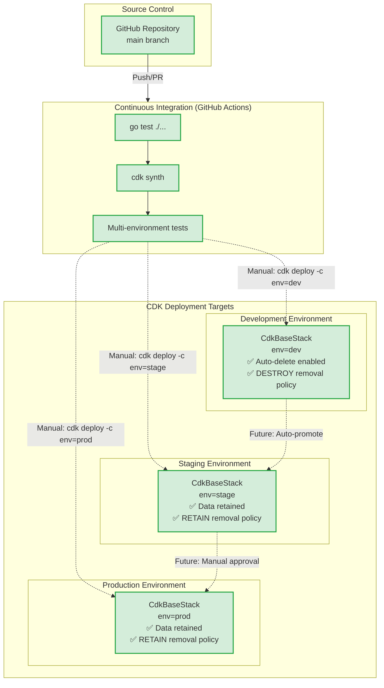

# Architecture: Event-Driven Sleep Audio Pipeline

> **Status:** Living design document — the single source of truth for the
> `cdk-sleep-go-copilot` system. Every future issue and pull request must keep
> this document (and its Mermaid diagram) in sync with the deployed
> infrastructure.
>
> **Implementation Status (as of Issue #12 - COMPLETE):** 
> - ✅ Core S3 Buckets (Input & Output) with encryption, versioning
> - ✅ EventBridge Rule for Object Created events
> - ✅ Step Functions State Machine (AudioProcessingStateMachine) with CloudWatch Logs
> - ✅ **Input validation** with Choice states and Lambda validation
> - ✅ **File extension validation** in Lambda (.mp3, .wav, .m4a, .flac, .ogg, .aac)
> - ✅ **Complete error handling** for Lambda and Polly tasks
> - ✅ Amazon Polly integration (SynthesizeSpeech) with neural voice engine
> - ✅ DynamoDB Table (SleepAudioMetadataTable) for audio pipeline metadata
> - ✅ State Machine DynamoDB integration (PutItem task for initial metadata)
> - ✅ SNS Topics for pipeline completion and failure notifications (encrypted with KMS)
> - ✅ **Enhanced error handling** with Catch blocks on all processing tasks
> - ✅ DynamoDB status updates (UpdateItem tasks) on success and failure paths
> - ✅ **Complete end-to-end wiring** from S3 upload to notifications
> - ✅ **Lambda Functions with full audio processing** (SleepAudioProcessor) - **Issue #7, #8 & #11**
> - ✅ **S3 download/upload operations** in Lambda for input/output handling - **Issue #11**
> - ✅ **Polly text-to-speech synthesis** for sleep narration - **Issue #11**
> - ✅ **DynamoDB metadata updates** with output file location and processing details - **Issue #11**
> - ✅ **Multi-environment support** (dev/stage/prod) with context-driven configuration - **Issue #9**
> - ✅ **Environment-specific removal policies** (DESTROY for dev, RETAIN for stage/prod) - **Issue #9**
> - ✅ **Expanded test coverage** for pipeline integration and validation - **Issue #9**
> - ✅ **Advanced retry policies** with exponential backoff on all tasks - **Issue #10**
> - ✅ **X-Ray tracing** enabled on Lambda and Step Functions - **Issue #10**
> - ✅ **Structured JSON logging** in Lambda with request IDs - **Issue #10**
> - ✅ **CloudWatch Alarms** for state machine and Lambda failures - **Issue #10**
> - ✅ **End-to-end validation tests** ensuring complete pipeline integrity - **Issue #12**
> - ✅ **Comprehensive documentation** with SUMMARY.md and polished README - **Issue #12**
> - ✅ **Project completion** with 54 passing tests and full observability - **Issue #12**
> - ⏳ CDK Pipelines construct for CI/CD deployment - planned for future enhancement

---

## 1. High-Level Overview

`cdk-sleep-go-copilot` is a fully serverless, **event-driven** pipeline on AWS,
authored with the AWS CDK in Go. It ingests raw, user-supplied audio (voice
recordings, ambient/white-noise captures), processes that audio into soothing
sleep content, and delivers enriched results plus notifications to downstream
consumers — all **without any always-on compute**.

The design is intentionally decoupled: each stage communicates through events
and managed AWS services rather than direct, synchronous calls. This yields a
system that auto-scales to demand, fails safely, and is cheap at rest.

Core capabilities:

- **Ingest** raw audio uploads into a private, encrypted input bucket.
- **Detect** new uploads automatically via **Amazon EventBridge**.
- **Orchestrate** multi-step processing with **AWS Step Functions**, including:
  - **Input validation** with Choice states verifying required fields.
  - **AWS Lambda** (Go) processes audio files:
    - Downloads input files from S3
    - Validates file formats (.mp3, .wav, .m4a, .flac, .ogg, .aac)
    - Synthesizes soothing speech with **Amazon Polly** neural voice engine
    - Uploads processed audio to output bucket with timestamped naming
    - Updates DynamoDB with output file location and metadata
  - **Amazon Polly** for text-to-speech / soothing narrated voice generation.
  - Metadata extraction and validation of the uploaded object.
- **Persist** processed audio to a **versioned** output bucket and structured
  metadata to **Amazon DynamoDB** with output file tracking.
- **Notify** users and operators of completion or failure through **Amazon
  SNS** with KMS encryption.
- **Observe** the entire flow with **Amazon CloudWatch** logs, metrics,
  alarms, and **AWS X-Ray** distributed tracing.
- **Promote** the same stack across **dev / stage / prod** environments using
  **CDK context** with environment-specific removal policies.

---

## 2. Data Flow

The pipeline progresses through seven logical stages. Each stage maps directly
to the labelled nodes in the [Mermaid diagram](#5-architecture-diagram).

### Stage 1 — Upload (Ingestion)

A client (mobile app, web app, or IoT device) uploads a raw audio file
(`.wav` / `.mp3`) to the **Input S3 Bucket** (`SleepAudioInputBucket`). The
bucket blocks all public access; clients authenticate through pre-signed URLs or
a Cognito Identity Pool, so credentials are never embedded in the client.

### Stage 2 — Detect (EventBridge)

S3 emits an `Object Created` notification to the default **Amazon EventBridge**
event bus. An **EventBridge rule** (`AudioUploadedRule`) matches the pattern
`source: aws.s3` / `detail-type: Object Created`, scoped to the input bucket,
and triggers the processing workflow. EventBridge decouples ingestion from
processing and provides a single place to add future targets (analytics,
auditing) without touching producers.

### Stage 3 — Orchestrate (Step Functions)

The rule starts an execution of the **`AudioProcessingStateMachine`** (AWS Step
Functions, Standard workflow). Step Functions is preferred over a single Lambda
because the work is multi-step, long-running, and benefits from built-in retry,
error-catch, and visual observability. 

**Current Implementation (Issue #8 - Complete Pipeline Wiring):**
The state machine orchestrates the following workflow with comprehensive input validation and error handling:

1. **Validate Input (Choice State)** — First state in the workflow that validates the input:
   - Checks if both `bucket` and `key` fields are present in the input
   - **Valid Input Path:** Proceeds to WriteInitialMetadata
   - **Invalid Input Path:** Routes to InvalidInputError → PublishFailedNotification

2. **Write Initial Metadata (DynamoDB PutItem)** — Records the initial metadata to
   the `SleepAudioMetadataTable` when processing begins. The record includes:
   - `audioId`: The S3 object key (partition key)
   - `inputBucket`: Source S3 bucket name
   - `inputKey`: Source S3 object key
   - `status`: Set to "PROCESSING" 
   - `createdAt`: Timestamp when processing started

3. **Process Audio File (Lambda Invocation)** — Invokes the `SleepAudioProcessor` Lambda
   function to perform full audio processing. The Lambda:
   - **Validates required fields:** Ensures bucket, key, and environment variables are present
   - **File extension validation:** Checks file extension against supported formats:
     - Supported: `.mp3`, `.wav`, `.m4a`, `.flac`, `.ogg`, `.aac`
     - Rejects unsupported formats with clear error messages
   - **Path traversal protection:** Validates file key doesn't contain ".."
   - **Downloads input file from S3:** Retrieves the audio file from the input bucket
   - **Audio Processing:**
     - For standard audio files: Passes through (placeholder for future normalization)
     - For text files (.txt): Synthesizes speech using Amazon Polly neural voice engine
   - **Uploads processed file to output S3 bucket:** 
     - Naming convention: `processed-<timestamp>-<original-filename>.<format>`
     - Example: `processed-20260610-120000-meditation.mp3`
   - **Updates DynamoDB metadata** with output information:
     - `outputBucket`: Output S3 bucket name
     - `outputKey`: Processed file S3 key
     - `fileSize`: Size of processed file in bytes
     - `duration`: Estimated duration in seconds
     - `format`: Audio format (mp3, wav, etc.)
     - `updatedAt`: Processing completion timestamp
   - **Returns structured response** with:
     - `status`: "processed"
     - `outputBucket`: Output bucket name
     - `outputKey`: Output file key
     - `metadata`: Processing details (processor version, file size, duration, format)
   - Uses Go runtime (provided.al2023) with AWS SDK for S3, Polly, and DynamoDB
   - **Timeout:** 5 minutes for audio processing
   - **Memory:** 512MB for processing operations
   - **Permissions:** Read from input bucket, write to output bucket, read/write DynamoDB, Polly:SynthesizeSpeech
   - **Error Handling:** Catch block captures all errors and routes to error path

4. **Polly SynthesizeSpeech** — Invokes Amazon Polly to synthesize speech from
   placeholder text (VoiceId: Joanna, OutputFormat: mp3). This demonstrates the
   integration pattern and establishes the orchestration layer.
   - **Error Handling:** Catch block captures all errors and routes to error handling path

5. **Error Handling Paths:**
   - **Lambda Validation Failure:**
     - FormatLambdaError (Pass state) → UpdateStatusFailed → PublishFailedNotification
   - **Polly Task Failure:**
     - FormatLambdaError (Pass state) → UpdateStatusFailed → PublishFailedNotification
   - **Invalid Input (from Choice State):**
     - InvalidInputError (Pass state) → PublishFailedNotification
   
   Error handling includes:
   - **Update Status to FAILED (DynamoDB UpdateItem)** — Updates the status field to
     "FAILED", sets updatedAt timestamp, and records the error message
   - **Publish Failed Notification (SNS)** — Sends a failure notification to the
     `SleepAudioPipelineFailedTopic` with error details, audioId, and bucket info

6. **Success Path** — On successful completion of all processing tasks:
   - **Update Status to COMPLETED (DynamoDB UpdateItem)** — Updates the status field to
     "COMPLETED" and sets the updatedAt timestamp
   - **Publish Completed Notification (SNS)** — Sends a success notification to the
     `SleepAudioPipelineCompletedTopic` with audioId, bucket, and success message

7. **CloudWatch Logs** — All execution logs are written to a dedicated log group
   with 7-day retention for debugging and audit.

8. **X-Ray Tracing** — Enabled for distributed tracing and performance analysis.

9. **Retry Policies (Issue #10)** — All tasks have configured retry policies with exponential backoff:
   - **Lambda Invocation Task:**
     - Maximum Attempts: 3
     - Initial Interval: 2 seconds
     - Backoff Rate: 2.0 (exponential: 2s, 4s, 8s)
     - Handled Errors: Lambda.ServiceException, Lambda.AWSLambdaException, Lambda.SdkClientException, Lambda.TooManyRequestsException
   
   - **Polly Task:**
     - Maximum Attempts: 3
     - Initial Interval: 1 second
     - Backoff Rate: 1.5 (exponential: 1s, 1.5s, 2.25s)
     - Handled Errors: Polly.ServiceFailureException, Polly.ThrottlingException, States.TaskFailed
   
   - **DynamoDB Tasks (PutItem, UpdateItem):**
     - Maximum Attempts: 3
     - Initial Interval: 1 second
     - Backoff Rate: 2.0 (exponential: 1s, 2s, 4s)
     - Handled Errors: DynamoDB.ProvisionedThroughputExceededException, DynamoDB.RequestLimitExceeded, DynamoDB.InternalServerError
   
   These retry policies handle transient failures automatically before routing to error handlers.

**Future Expansion (Issue #11+):**
The state machine will coordinate these additional steps:
1. **Enhanced Audio Validation** — The `SleepAudioProcessor` Lambda will be
   extended to verify audio format, size, duration, and sample rate using AWS SDK or
   third-party libraries.
2. **Generate Voice (Amazon Polly)** — continues to synthesize soothing narration /
   guided sleep audio from configured text or user-supplied prompts.
3. **Enhance / Generate Soundscape (Amazon Bedrock)** — *optional* step
   (feature-flagged via CDK context) that uses Bedrock to generate or enhance
   ambient sleep sounds. When disabled, the branch is skipped.
4. **Assemble & Store** — a `FinalizeAudio` Lambda writes the processed audio to
   the output bucket and updates the final metadata in DynamoDB (status: COMPLETED/FAILED).

Each task state defines explicit `Retry` and `Catch` rules; any unhandled error
routes to the **failure-notification** state.

### Stage 4 — Store Audio (Output S3)

Processed audio is written to the **Output S3 Bucket**
(`SleepAudioOutputBucket`), which has **S3 Versioning enabled** so that
re-processing or corrections never destroy prior results. The bucket is private
and encrypted at rest.

### Stage 5 — Store Metadata (DynamoDB)

**Current Implementation (Issue #6):**
Audio processing metadata is persisted to the **`SleepAudioMetadataTable`**
DynamoDB table throughout the workflow execution lifecycle. The table schema:
- **Partition Key:** `audioId` (string) — the S3 object key identifying the audio file
- **Attributes:** `inputBucket`, `inputKey`, `status`, `createdAt`, `updatedAt`, `errorMessage`
- **Billing Mode:** On-demand (PAY_PER_REQUEST) to match spiky, event-driven workload
- **Encryption:** AWS-managed server-side encryption (SSE) enabled
- **Point-in-Time Recovery:** Enabled for data durability and recovery

The state machine updates the metadata at three key points:
1. **Initial Record (PutItem)** — Writes initial metadata with status "PROCESSING" when workflow starts
2. **Success Update (UpdateItem)** — Updates status to "COMPLETED" and sets updatedAt timestamp
3. **Failure Update (UpdateItem)** — Updates status to "FAILED", sets updatedAt timestamp, and records error message

**Future Expansion (Issue #7+):**
The schema may be extended to include additional session metadata such as `user_id`,
`session_id`, `duration`, `output_key`, and richer processing details.

### Stage 6 — Notify (SNS)

**Current Implementation (Issue #6):**
The pipeline includes comprehensive notification capabilities through two dedicated SNS topics:

- **`SleepAudioPipelineCompletedTopic`** — Receives success notifications when audio
  processing completes successfully. The notification message includes:
  - Status: "COMPLETED"
  - audioId: S3 object key
  - bucket: S3 bucket name
  - message: Success confirmation

- **`SleepAudioPipelineFailedTopic`** — Receives failure notifications when errors occur
  during processing. The notification message includes:
  - Status: "FAILED"
  - audioId: S3 object key
  - bucket: S3 bucket name
  - error: Error details from the failed state
  - message: Failure description

Both topics are encrypted using AWS KMS with automatic key rotation enabled for security.
Subscribers (email, mobile push, ops webhook) can react to pipeline events without being
coupled to the pipeline internals.

**Future Expansion (Issue #7+):**
CloudWatch Alarms will monitor state machine execution failures and Lambda errors,
publishing additional alerts to these SNS topics to ensure no failure is silently lost.

### Stage 7 — Observe (CloudWatch)

Every Lambda and the Step Functions execution emit structured logs to
**CloudWatch Logs**. **CloudWatch Alarms** watch for `ExecutionsFailed` on the
state machine and Lambda `Errors`, alerting the operations team via SNS so no
failure is silently lost.

---

## 3. Key AWS Services & Rationale

| Service | Role in Pipeline | Why It Was Chosen |
|---|---|---|
| **Amazon S3** (input + output) | Durable object storage for raw and processed audio | 11 nines durability; native EventBridge integration; output bucket versioning protects against accidental overwrite during re-processing |
| **Amazon EventBridge** | Detects uploads and triggers processing | Fully decouples producers from consumers; declarative event patterns; easy to add new targets later |
| **AWS Step Functions** | Orchestrates the multi-step processing workflow | Built-in retries, error catching, and a visual execution history; ideal for long-running, multi-service coordination — preferred over a monolithic Lambda |
| **AWS Lambda** | Validation, metadata extraction, finalization tasks | Serverless, pay-per-use compute for the discrete glue steps inside the state machine |
| **Amazon Polly** | Text-to-speech / soothing narrated voice | Managed, high-quality neural TTS; no model hosting required |
| **Amazon Bedrock** *(optional)* | AI-generated sleep soundscapes / audio enhancement | Access to foundation models without managing infrastructure; gated behind a CDK context flag to control cost |
| **Amazon DynamoDB** | Session metadata & processing status | Single-digit-ms reads/writes; on-demand billing fits bursty event traffic |
| **Amazon SNS** | Completion and error notifications | Fan-out to many subscriber types (email, push, webhooks) with one publish |
| **Amazon CloudWatch** | Logs, metrics, alarms | Centralized observability and alerting across all components |
| **AWS IAM** | Least-privilege access control | Scopes every role to the minimum actions/resources required |

---

## 4. Component Inventory

| Logical Name | AWS Service | Notes |
|---|---|---|
| `SleepAudioInputBucket` | S3 | Private, encrypted, public access blocked; EventBridge notifications enabled |
| `AudioUploadedRule` | EventBridge Rule | Matches `Object Created` on the input bucket; targets the state machine |
| `AudioProcessingStateMachine` | Step Functions (Standard) | Orchestrates DynamoDB writes, Lambda processing, Polly, status updates, and notifications with error handling |
| `SleepAudioProcessor` | Lambda (Go) | Validates audio files and extracts metadata; invoked by state machine (**✅ Implemented**) |
| `SleepAudioMetadataTable` | DynamoDB | PK `audioId`; stores pipeline metadata with status tracking; on-demand billing |
| `SleepAudioPipelineCompletedTopic` | SNS | Success notifications; KMS-encrypted (**✅ Implemented**) |
| `SleepAudioPipelineFailedTopic` | SNS | Failure notifications; KMS-encrypted (**✅ Implemented**) |
| `FinalizeAudio` | Lambda | Writes processed audio to output bucket and updates metadata (**⏳ Planned**) |
| `SleepAudioOutputBucket` | S3 | Private, encrypted, **versioning enabled** |
| Polly / Bedrock | Managed AI | Invoked as Step Functions service integrations |
| Log groups + alarms | CloudWatch | Per-Lambda logs, state-machine logs, failure alarms |

### Currently Implemented (Issue #8 - Complete Pipeline Wiring)

The following core components are **currently deployed** in the CDK stack:

#### `SleepAudioInputBucket` (AWS::S3::Bucket)
- **Encryption:** S3-managed (SSE-S3 / AES256)
- **Versioning:** Enabled
- **Public Access:** Blocked (all four block settings enabled)
- **EventBridge Notifications:** Enabled via `EventBridgeEnabled: true`
- **Purpose:** Receives raw audio uploads from authenticated clients via pre-signed URLs or Cognito

#### `SleepAudioOutputBucket` (AWS::S3::Bucket)
- **Encryption:** S3-managed (SSE-S3 / AES256)
- **Versioning:** Enabled
- **Public Access:** Blocked (all four block settings enabled)
- **Purpose:** Stores processed/enriched audio files after pipeline completion

#### `AudioUploadedRule` (AWS::Events::Rule)
- **Event Pattern:** Matches `source: aws.s3`, `detail-type: Object Created`
- **Scope:** Filters events to only the `SleepAudioInputBucket`
- **State:** Enabled
- **Target:** Targets the `AudioProcessingStateMachine` with S3 bucket and key as input
- **Purpose:** Detects new audio uploads and triggers the processing workflow

#### `AudioProcessingStateMachine` (AWS::StepFunctions::StateMachine)
- **Type:** Standard workflow
- **States:** 
  1. **ValidateInput** — Choice state that validates presence of bucket and key fields
  2. **InvalidInputError** — Pass state that formats error message for invalid input
  3. **WriteInitialMetadata** — DynamoDB PutItem task that writes initial metadata record
  4. **ProcessAudioFile** — Lambda invocation task that validates audio and extracts metadata
  5. **FormatLambdaError** — Pass state that formats Lambda error messages for downstream processing
  6. **PollyTask** — SynthesizeSpeech task (placeholder) with error handling
  7. **UpdateStatusCompleted** — DynamoDB UpdateItem task to mark status as "COMPLETED"
  8. **PublishCompletedNotification** — SNS Publish task to success topic
  9. **UpdateStatusFailed** — DynamoDB UpdateItem task to mark status as "FAILED" (error path)
  10. **PublishFailedNotification** — SNS Publish task to failure topic (error path)
- **Error Handling:** 
  - Catch blocks on ProcessAudioFile and PollyTask capture all errors and route to failure path
  - InvalidInputError handles missing required fields
  - All error paths update DynamoDB status and send SNS notifications
- **Logging:** CloudWatch Logs enabled (ALL level) to `StateMachineLogGroup`
- **Tracing:** X-Ray tracing enabled
- **Execution Role:** Least-privilege IAM role with permissions for DynamoDB (PutItem, UpdateItem), Lambda (InvokeFunction), Polly, SNS (Publish), CloudWatch Logs, and X-Ray
- **Input:** Receives S3 bucket name and object key from EventBridge event
- **Output:** Updates DynamoDB status and sends SNS notifications on success or failure
- **Purpose:** Orchestrates the complete audio processing workflow with comprehensive validation, error handling, metadata tracking, and notifications

#### `SleepAudioProcessor` (AWS::Lambda::Function)
- **Runtime:** provided.al2023 (Go 1.25)
- **Handler:** bootstrap
- **Timeout:** 5 minutes (increased for audio processing - Issue #11)
- **Memory:** 512 MB (increased for audio processing - Issue #11)
- **Code:** lambda/audio-processor/main.go
- **Environment Variables:** 
  - `TABLE_NAME`: DynamoDB table name for metadata
  - `OUTPUT_BUCKET`: S3 bucket name for processed audio output (Issue #11)
- **IAM Permissions:** 
  - **S3 Input Bucket:** GetObject*, GetBucket*, List* (read access - Issue #11)
  - **S3 Output Bucket:** PutObject*, Abort* (write access - Issue #11)
  - **DynamoDB:** GetItem, PutItem, UpdateItem (read/write access - Issue #11)
  - **Polly:** SynthesizeSpeech (text-to-speech generation - Issue #11)
  - **CloudWatch Logs:** CreateLogGroup, CreateLogStream, PutLogEvents
  - **X-Ray:** PutTraceSegments, PutTelemetryRecords
- **X-Ray Tracing:** Active mode enabled for distributed tracing (Issue #10)
- **Structured Logging (Issue #10):**
  - JSON-formatted log entries with:
    - `timestamp`: RFC3339 format timestamp
    - `level`: Log level (INFO, ERROR)
    - `message`: Human-readable message
    - `requestId`: Lambda request ID for correlation
    - `bucket`, `key`: S3 context
    - `status`: Processing status
    - `error`: Error details (when applicable)
    - `metadata`: Additional context (extension, processor version)
  - Enables efficient log parsing, CloudWatch Insights queries, and log aggregation
- **Audio Processing Logic (Issue #11):**
  - **Download:** Retrieves input file from S3 input bucket
  - **Processing:**
    - For audio files (.mp3, .wav, etc.): Pass-through mode (placeholder for future normalization)
    - For text files (.txt): Synthesizes speech using Amazon Polly neural voice (Joanna)
  - **Upload:** Saves processed audio to S3 output bucket with timestamped naming:
    - Format: `processed-<YYYYMMDD-HHMMSS>-<original-name>.<format>`
    - Example: `processed-20260610-120000-meditation.mp3`
  - **Metadata Update:** Updates DynamoDB with:
    - `outputBucket`: Output S3 bucket name
    - `outputKey`: Processed file S3 key
    - `fileSize`: File size in bytes
    - `duration`: Estimated duration in seconds
    - `format`: Audio format (mp3, wav, etc.)
    - `updatedAt`: Processing completion timestamp
- **Validation Logic:**
  - **Required fields:** Validates bucket, key, and environment variables are present
  - **File extension:** Validates against supported formats (.mp3, .wav, .m4a, .flac, .ogg, .aac)
  - **Path traversal:** Prevents ".." in file paths
  - Returns descriptive error messages for validation failures
- **Purpose:** Processes audio files end-to-end: downloads from S3, applies transformations (Polly synthesis), uploads to output bucket, and updates metadata
- **Input:** Receives bucket and key from state machine (via DynamoDB result context)
- **Output:** Returns processing status ("processed"), output location (outputBucket, outputKey), and enriched metadata (file size, duration, format, processor version 2.0.0)
- **Error Handling:** Throws errors for invalid input or processing failures that are caught by state machine Catch blocks

#### `SleepAudioMetadataTable` (AWS::DynamoDB::Table)
- **Partition Key:** `audioId` (String) — S3 object key identifying the audio file
- **Billing Mode:** PAY_PER_REQUEST (on-demand)
- **Encryption:** AWS-managed SSE enabled
- **Point-in-Time Recovery:** Enabled
- **Attributes Stored:** 
  - `audioId`: S3 object key (partition key)
  - `inputBucket`: Source S3 bucket name
  - `inputKey`: Source S3 object key
  - `outputBucket`: Processed file S3 bucket name (Issue #11)
  - `outputKey`: Processed file S3 key (Issue #11)
  - `fileSize`: Processed file size in bytes (Issue #11)
  - `duration`: Audio duration in seconds (Issue #11)
  - `format`: Audio format (mp3, wav, etc.) (Issue #11)
  - `status`: Processing status (PROCESSING, COMPLETED, FAILED)
  - `createdAt`: Processing start timestamp
  - `updatedAt`: Last update timestamp
  - `errorMessage`: Error details (when status is FAILED)
- **Purpose:** Tracks audio processing pipeline metadata from start to completion with status updates and output file tracking

#### `SleepAudioPipelineCompletedTopic` (AWS::SNS::Topic)
- **Display Name:** Sleep Audio Pipeline Completed
- **Encryption:** KMS encryption with automatic key rotation enabled
- **Purpose:** Receives success notifications when audio processing completes successfully

#### `SleepAudioPipelineFailedTopic` (AWS::SNS::Topic)
- **Display Name:** Sleep Audio Pipeline Failed
- **Encryption:** KMS encryption with automatic key rotation enabled
- **Purpose:** Receives failure notifications when errors occur during processing

#### `SnsTopicKey` (AWS::KMS::Key)
- **Description:** KMS key for SNS topic encryption
- **Key Rotation:** Enabled for automatic annual rotation
- **Purpose:** Provides encryption-at-rest for SNS topic messages

#### `StateMachineLogGroup` (AWS::Logs::LogGroup)
- **Retention:** 7 days
- **Purpose:** Stores all Step Functions execution logs for debugging and audit

#### Polly Integration (Task State)
- **Action:** `polly:synthesizeSpeech`
- **Configuration:** Placeholder parameters (Text, VoiceId: Joanna, OutputFormat: mp3)
- **Error Handling:** Catch block captures all errors and routes to failure notification path
- **Purpose:** Demonstrates Amazon Polly integration; real audio processing logic to be added in future issues

#### DynamoDB PutItem Integration (Task State)
- **Action:** `dynamodb:PutItem`
- **Table:** `SleepAudioMetadataTable`
- **Item:** Writes initial metadata including audioId, inputBucket, inputKey, status (PROCESSING), createdAt
- **Purpose:** Tracks pipeline execution state from the beginning of workflow

#### DynamoDB UpdateItem Integration - Success (Task State)
- **Action:** `dynamodb:UpdateItem`
- **Table:** `SleepAudioMetadataTable`
- **Update:** Sets status to "COMPLETED" and updates timestamp
- **Purpose:** Marks successful completion of audio processing workflow

#### DynamoDB UpdateItem Integration - Failure (Task State)
- **Action:** `dynamodb:UpdateItem`
- **Table:** `SleepAudioMetadataTable`
- **Update:** Sets status to "FAILED", updates timestamp, and records error message
- **Purpose:** Marks failed audio processing workflow with error details

#### SNS Publish Integration - Success (Task State)
- **Action:** `sns:Publish`
- **Topic:** `SleepAudioPipelineCompletedTopic`
- **Message:** Success notification with audioId, bucket, and status
- **Purpose:** Notifies subscribers of successful pipeline completion

#### SNS Publish Integration - Failure (Task State)
- **Action:** `sns:Publish`
- **Topic:** `SleepAudioPipelineFailedTopic`
- **Message:** Failure notification with audioId, bucket, error, and status
- **Purpose:** Notifies subscribers of pipeline failures for operational awareness

#### CloudWatch Alarms (Issue #10)
- **State Machine Failure Alarm:** Monitors `ExecutionsFailed` metric (threshold: ≥1 in 5 minutes)
- **Lambda Error Alarm:** Monitors `Errors` metric (threshold: ≥5 in 5 minutes)
- **Actions:** Both alarms publish to `SleepAudioPipelineFailedTopic` for operational alerts
- **Purpose:** Proactive monitoring of critical failure paths in the pipeline

### Not Yet Implemented (Future Issues)
- **Enhanced Audio Validation** in SleepAudioProcessor (deep format verification using audio libraries, bitrate checks) — Issue #12+
- **Audio Normalization** - Loudness normalization, format conversion — Issue #12+
- **Advanced Audio Effects** - Background ambient sounds, fade in/out, mixing — Issue #12+
- **CloudWatch Dashboard** - Unified dashboard showing key metrics — Issue #12+
- **Amazon Bedrock Integration** - AI-generated sleep soundscapes — Future

---

## 5. Architecture Diagram

> **Legend:**  
> - **Solid green borders** = Currently implemented (Issue #8)  
> - **Dashed borders** = Planned for future issues



---

## 5.1. Deployment & Environment Structure

The following diagram illustrates the multi-environment deployment architecture implemented in Issue #9:



**Key Features (Issue #9):**
- ✅ Environment-aware stack configuration via CDK context
- ✅ Different removal policies per environment (dev=DESTROY, stage/prod=RETAIN)
- ✅ Auto-delete objects in dev for rapid iteration
- ✅ Comprehensive test coverage for environment-specific behavior
- ⏳ CDK Pipelines for automated deployment (planned for Issue #10+)

---

## 6. Security

- **Private buckets:** Both the input and output S3 buckets block all public
  access and enforce TLS-only access policies.
- **Encryption at rest:** S3 (SSE), DynamoDB, and SNS are encrypted at rest;
  CloudWatch Logs use encrypted log groups.
- **Encryption in transit:** All inter-service traffic uses HTTPS/TLS.
- **Least-privilege IAM:** Every Lambda, the state machine role, and the
  EventBridge rule receive narrowly scoped policies — no `*` actions or
  resources. For example, `FinalizeAudio` may write only to the output bucket
  prefix and the single DynamoDB table.
- **No secrets in source:** Account IDs, ARNs, and configuration are supplied
  through CDK context / SSM Parameter Store, never committed to the repository.
- **Authenticated uploads:** Clients use pre-signed URLs or Cognito-issued
  credentials; the buckets themselves are never publicly writable.

---

## 7. Observability

**Current Implementation (Issue #10):**

### Structured Logging
- **Lambda Functions:** Emit JSON-formatted logs to CloudWatch with:
  - Timestamp (RFC3339 format)
  - Log level (INFO, ERROR)
  - Request ID for correlation
  - Contextual information (bucket, key, status, error details)
  - Metadata (extension, processor version, timestamps)
- **Step Functions:** Comprehensive execution logs (ALL level) to dedicated log group
  - 7-day retention for cost optimization
  - Captures all state transitions, inputs, and outputs
- **CloudWatch Insights:** JSON structure enables efficient querying and analysis

### Distributed Tracing
- **X-Ray Tracing:** Enabled on Lambda function and Step Functions state machine
  - Active mode provides detailed trace segments
  - Tracks request flow across services
  - Performance analysis and bottleneck identification
  - Service map visualization

### CloudWatch Alarms
Two critical alarms monitor pipeline health and publish to the `SleepAudioPipelineFailedTopic`:

1. **State Machine Execution Failure Alarm**
   - **Metric:** `AWS/States ExecutionsFailed`
   - **Threshold:** ≥ 1 failed execution
   - **Period:** 5 minutes
   - **Statistic:** Sum
   - **Evaluation Periods:** 1
   - **Action:** Publish to SleepAudioPipelineFailedTopic
   - **Treat Missing Data:** Not breaching (no alarm when no executions)

2. **Lambda Error Alarm**
   - **Metric:** `AWS/Lambda Errors`
   - **Threshold:** ≥ 5 errors
   - **Period:** 5 minutes
   - **Statistic:** Sum
   - **Evaluation Periods:** 1
   - **Action:** Publish to SleepAudioPipelineFailedTopic
   - **Treat Missing Data:** Not breaching (no alarm when no invocations)

### Execution History
- Step Functions provides a visual, per-execution audit trail of every state transition, input, and output
- Enables debugging and root cause analysis without deep log diving

### Traceability
- Lambda request IDs correlate logs across invocations
- A `session_id` (audioId) correlates the input object, state-machine
  execution, output object, DynamoDB record, and notifications end to end.

---

## 8. Cost Considerations

- **Serverless & event-driven:** There is no idle compute — costs accrue only
  while audio is actually being processed.
- **On-demand DynamoDB:** Pay-per-request billing avoids over-provisioning for a
  bursty workload.
- **Optional Bedrock:** The most expensive step is feature-flagged via CDK
  context and disabled by default in lower environments.
- **S3 lifecycle:** Input objects can transition to Intelligent-Tiering or
  expire after processing; output versions can be lifecycle-managed to control
  storage growth.
- **Right-sized Lambdas:** Memory/timeout tuned per task to minimize
  GB-second cost.

---

## 9. Multi-Environment Support (dev / stage / prod)

**✅ Implemented in Issue #9**

The stack is fully environment-aware through **CDK context**. An `env` context value
(`dev`, `stage`, or `prod`) drives per-environment configuration:

### Environment-Specific Behavior

| Configuration | dev | stage | prod |
|--------------|-----|-------|------|
| **Removal Policy (S3)** | `DESTROY` | `RETAIN` | `RETAIN` |
| **Removal Policy (DynamoDB)** | `DESTROY` | `RETAIN` | `RETAIN` |
| **Auto-Delete Objects (S3)** | `true` | `false` | `false` |
| **Bedrock Enhancement** | Disabled | Optional | Optional |
| **Log Retention** | 7 days | 30 days | 90 days (planned) |

### Usage

```bash
# Synthesize/deploy a specific environment
cdk synth -c env=dev       # Development - easy cleanup
cdk synth -c env=stage     # Staging - data retained
cdk deploy -c env=prod     # Production - data retained

# Default behavior (from cdk.json)
cdk synth                  # Uses env=dev by default
```

### Implementation Details

The stack reads the `env` context value in `NewCdkBaseStack()`:
- **Default:** `dev` (defined in `cdk.json` context)
- **Removal Policies:** 
  - `dev` → `RemovalPolicy_DESTROY` for easy cleanup and rapid iteration
  - `stage`/`prod` → `RemovalPolicy_RETAIN` for data safety
- **Auto-Delete Objects:** Only enabled in `dev` to allow complete stack teardown
- **Test Coverage:** Comprehensive tests verify environment-specific behavior

### Future Extensions

- **Resource name prefixes:** Add environment suffix to resource names for easier identification
- **Alarm thresholds:** Adjust CloudWatch alarm sensitivity per environment
- **Lambda concurrency:** Set reserved concurrency in prod, unreserved in dev
- **DynamoDB capacity:** Consider provisioned capacity in prod for cost optimization

---

## 10. Deployment & CI/CD Strategy

### Current Deployment Approach (Issue #9)

The application is deployed using standard CDK CLI commands:

```bash
# Development environment (quick iteration, auto-cleanup)
cdk deploy -c env=dev

# Staging environment (pre-production validation)
cdk deploy -c env=stage

# Production environment (live workloads)
cdk deploy -c env=prod
```

### Continuous Integration (GitHub Actions)

The `.github/workflows/ci.yml` workflow runs on every push and pull request:

1. **Go Tests:** `go test ./...` - validates all CDK construct tests
2. **CDK Synth:** `cdk synth` - ensures the stack synthesizes without errors
3. **Environment Tests:** Tests verify multi-environment behavior (dev/stage/prod)

### Deployment Preparation (Issue #9)

Multi-environment support has been implemented to prepare for CDK Pipelines:
- ✅ Environment context reading (dev/stage/prod)
- ✅ Environment-specific removal policies
- ✅ Auto-delete resources in dev for rapid iteration
- ✅ Comprehensive test coverage for environment behavior
- ⏳ CDK Pipelines construct (planned for Issue #10+)

### Future: CDK Pipelines (Planned)

A self-mutating deployment pipeline will be added using `aws-cdk-lib/pipelines`:

**Planned Pipeline Stages:**
1. **Source:** GitHub repository (main branch)
2. **Build:** Run `go test` and `cdk synth`
3. **Dev Deploy:** Auto-deploy to dev environment
4. **Stage Deploy:** Deploy to staging with approval
5. **Prod Deploy:** Deploy to production with manual approval

**Benefits:**
- Automated deployments on merge to main
- Self-updating pipeline infrastructure
- Environment promotion with approvals
- Integration test stages between environments

---

## 11. Documentation Architecture

**Documentation Strategy (Issue #13):**

The project maintains a comprehensive, multi-layered documentation structure designed to serve different audiences and use cases.

### Documentation Layers

```
┌─────────────────────────────────────────────────────────┐
│                      README.md                          │
│              (Entry Point for All Users)                │
│  - Project overview and "Why This Project?"             │
│  - Table of contents for easy navigation                │
│  - Quick start guide                                    │
│  - Experiment methodology and meta-prompting            │
└──────────────────────┬──────────────────────────────────┘
                       │
        ┌──────────────┼──────────────┬───────────────┐
        ▼              ▼              ▼               ▼
┌──────────────┐ ┌──────────────┐ ┌──────────────┐ ┌──────────────────┐
│ARCHITECTURE  │ │  EXPERIMENT  │ │   SUMMARY    │ │   CONTRIBUTING   │
│   .md        │ │    .md       │ │    .md       │ │      .md         │
│              │ │              │ │              │ │                  │
│Technical     │ │Experimental  │ │Project       │ │TDD Workflow &    │
│Design &      │ │Methodology & │ │Completion    │ │Contribution      │
│Data Flow     │ │Observations  │ │& Lessons     │ │Guidelines        │
└──────────────┘ └──────────────┘ └──────────────┘ └──────────────────┘
        │
        ▼
┌───────────────────────────────────────────────────────┐
│              .github/ Directory                       │
│                                                       │
│  ┌───────────────────────────────────────────────┐   │
│  │  AGENT_GUIDELINES.md                          │   │
│  │  - Agent persona definition                   │   │
│  │  - Strict TDD rules                           │   │
│  │  - Development workflow                       │   │
│  └───────────────────────────────────────────────┘   │
│                                                       │
│  ┌───────────────────────────────────────────────┐   │
│  │  META-PROMPTS.md (New - Issue #13)            │   │
│  │  - Reusable meta-prompting patterns           │   │
│  │  - Agent persona templates                    │   │
│  │  - Testing patterns for IaC                   │   │
│  │  - Security & observability checklists        │   │
│  └───────────────────────────────────────────────┘   │
│                                                       │
│  ┌───────────────────────────────────────────────┐   │
│  │  templates/ (New - Issue #13)                 │   │
│  │  ├── ISSUE_TEMPLATE_TDD_IaC.md                │   │
│  │  ├── PULL_REQUEST_TEMPLATE.md                 │   │
│  │  ├── AGENT_PROMPT_TEMPLATE.md                 │   │
│  │  └── README.md (template usage guide)         │   │
│  └───────────────────────────────────────────────┘   │
└───────────────────────────────────────────────────────┘
```

### Documentation Principles

1. **Single Source of Truth**  
   ARCHITECTURE.md is the canonical reference for system design. All changes to infrastructure topology must update this document.

2. **Living Documentation**  
   Documentation is updated in the same PR as code changes. No divergence allowed.

3. **Multi-Audience Design**  
   - **README.md** - All users (quick start, features, overview)
   - **ARCHITECTURE.md** - Developers and architects (technical design)
   - **EXPERIMENT.md** - Researchers and AI practitioners (methodology, observations)
   - **SUMMARY.md** - Project managers and stakeholders (status, decisions)
   - **CONTRIBUTING.md** - Contributors (workflow, standards)
   - **AGENT_GUIDELINES.md** - AI agents and automation (persona, rules)
   - **META-PROMPTS.md** - Future IaC projects (reusable patterns)

4. **Extractable Patterns**  
   Key patterns and templates are extracted into reusable formats in `.github/templates/` for application to other projects.

### Meta-Prompting Documentation

The project's meta-prompting approach is documented at three levels:

1. **Project-Specific** (`.github/AGENT_GUIDELINES.md`)  
   - Agent persona for this specific project
   - Project-specific strict rules
   - Workflow tailored to cdk-sleep-go-copilot

2. **Reusable Patterns** (`.github/META-PROMPTS.md`)  
   - Generalized patterns extracted from this project
   - Applicable to any TDD IaC project
   - Templates for agent personas, testing, security

3. **Ready-to-Use Templates** (`.github/templates/`)  
   - Copy-paste templates for issues, PRs, agent prompts
   - Customizable for different languages/frameworks
   - Include usage guides and best practices

### Documentation Metrics (Issue #13 + #14)

- **Total Documentation Files:** 8 primary + 4 templates = 12 files
- **Core Documents:** README, ARCHITECTURE, EXPERIMENT, SUMMARY, CONTRIBUTING, AGENT_GUIDELINES, META-PROMPTS, (+ issue/PR templates)
- **README Enhancement:** Added table of contents, "Why This Project?", experiment methodology, meta-prompting sections
- **New Documents:** 
  - META-PROMPTS.md (20KB+, Issue #13) - Reusable patterns
  - EXPERIMENT.md (24KB, Issue #14) - Experimental design & methodology
  - 4 reusable templates (Issue #13)
- **Link Validation:** 100% verified working links
- **Audience Coverage:** Users, developers, architects, project managers, AI agents, researchers

---

## 12. Future Extensibility

- **Additional EventBridge targets:** Add analytics, auditing, or a data-lake
  ingestion target without modifying producers.
- **Transcription & analysis:** Insert an Amazon Transcribe step for
  speech-to-text and sleep-quality scoring.
- **Personalization:** Use DynamoDB Streams to trigger per-user recommendation
  or digest workflows.
- **Multi-region:** Replicate buckets and tables for resilience or data
  residency.
- **API layer:** Front the pipeline with API Gateway + Cognito for managed
  upload and status endpoints.

---

## 13. AWS Well-Architected Alignment

| Pillar | Design Decision |
|---|---|
| Operational Excellence | CI enforces `go test` + `cdk synth` on every commit; Step Functions gives visual execution history |
| Security | Private encrypted buckets; least-privilege IAM; authenticated uploads; no secrets in source |
| Reliability | Step Functions retries/catches; CloudWatch alarms ensure no failure is silently lost; output bucket versioning |
| Performance Efficiency | Serverless components auto-scale to ingestion rate |
| Cost Optimisation | Pay-per-use compute and on-demand DynamoDB; optional Bedrock gated by context |
| Sustainability | Event-driven activation only; no idle resources |

---

> **Keep this document in sync.** Update this description **and** the Mermaid
> diagram in the same pull request whenever the deployed constructs, event flow,
> or component relationships change. This file is the canonical reference for
> all subsequent TDD issues.
