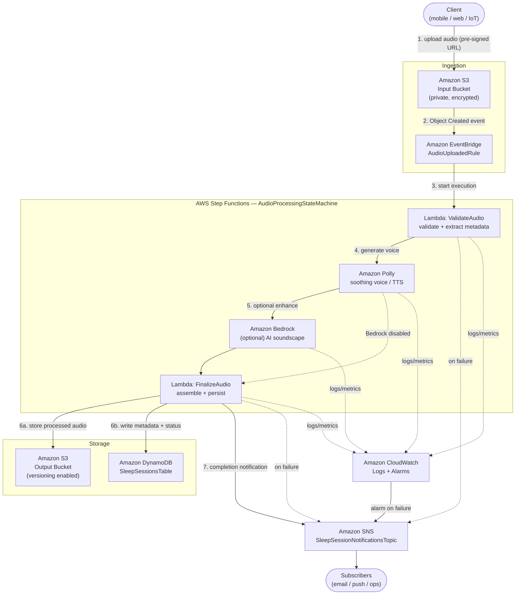

# Architecture: Event-Driven Sleep Audio Pipeline

> **Status:** Living design document — the single source of truth for the
> `cdk-sleep-go-copilot` system. Every future issue and pull request must keep
> this document (and its Mermaid diagram) in sync with the deployed
> infrastructure. No CDK stack code exists yet; this document defines the target
> design that the Test-Driven Development (TDD) issues will implement
> incrementally.

---

## 1. High-Level Overview

`cdk-sleep-go-copilot` is a fully serverless, **event-driven** pipeline on AWS,
authored with the AWS CDK in Go. It ingests raw, user-supplied audio (voice
recordings, ambient/white-noise captures), processes that audio into soothing
sleep content, and delivers enriched results plus notifications to downstream
consumers — all **without any always-on compute**.

The design is intentionally decoupled: each stage communicates through events
and managed AWS services rather than direct, synchronous calls. This yields a
system that auto-scales to demand, fails safely, and is cheap at rest.

Core capabilities:

- **Ingest** raw audio uploads into a private, encrypted input bucket.
- **Detect** new uploads automatically via **Amazon EventBridge**.
- **Orchestrate** multi-step processing with **AWS Step Functions**, including:
  - **Amazon Polly** for text-to-speech / soothing narrated voice generation.
  - **Amazon Bedrock** (optional) for AI-generated sleep soundscapes and audio
    enhancement.
  - Metadata extraction and validation of the uploaded object.
- **Persist** processed audio to a **versioned** output bucket and structured
  metadata to **Amazon DynamoDB**.
- **Notify** users and operators of completion or failure through **Amazon
  SNS**.
- **Observe** the entire flow with **Amazon CloudWatch** logs, metrics, and
  alarms.
- **Promote** the same stack across **dev / stage / prod** environments using
  **CDK context**.

---

## 2. Data Flow

The pipeline progresses through seven logical stages. Each stage maps directly
to the labelled nodes in the [Mermaid diagram](#5-architecture-diagram).

### Stage 1 — Upload (Ingestion)

A client (mobile app, web app, or IoT device) uploads a raw audio file
(`.wav` / `.mp3`) to the **Input S3 Bucket** (`SleepAudioInputBucket`). The
bucket blocks all public access; clients authenticate through pre-signed URLs or
a Cognito Identity Pool, so credentials are never embedded in the client.

### Stage 2 — Detect (EventBridge)

S3 emits an `Object Created` notification to the default **Amazon EventBridge**
event bus. An **EventBridge rule** (`AudioUploadedRule`) matches the pattern
`source: aws.s3` / `detail-type: Object Created`, scoped to the input bucket,
and triggers the processing workflow. EventBridge decouples ingestion from
processing and provides a single place to add future targets (analytics,
auditing) without touching producers.

### Stage 3 — Orchestrate (Step Functions)

The rule starts an execution of the **`AudioProcessingStateMachine`** (AWS Step
Functions, Standard workflow). Step Functions is preferred over a single Lambda
because the work is multi-step, long-running, and benefits from built-in retry,
error-catch, and visual observability. The state machine coordinates:

1. **Validate & Extract Metadata** — a `ValidateAudio` Lambda verifies the
   object (format, size, duration, sample rate) and records the initial
   `PENDING` record. Invalid input transitions straight to the failure path.
2. **Generate Voice (Amazon Polly)** — synthesizes soothing narration / guided
   sleep audio from configured text or user-supplied prompts.
3. **Enhance / Generate Soundscape (Amazon Bedrock)** — *optional* step
   (feature-flagged via CDK context) that uses Bedrock to generate or enhance
   ambient sleep sounds. When disabled, the branch is skipped.
4. **Assemble & Store** — a `FinalizeAudio` Lambda writes the processed audio to
   the output bucket and the final metadata to DynamoDB.

Each task state defines explicit `Retry` and `Catch` rules; any unhandled error
routes to the **failure-notification** state.

### Stage 4 — Store Audio (Output S3)

Processed audio is written to the **Output S3 Bucket**
(`SleepAudioOutputBucket`), which has **S3 Versioning enabled** so that
re-processing or corrections never destroy prior results. The bucket is private
and encrypted at rest.

### Stage 5 — Store Metadata (DynamoDB)

Structured session metadata is persisted to the **`SleepSessionsTable`**
DynamoDB table — `user_id`, `session_id`, `duration`, `processing_status`,
`input_key`, `output_key`, and timestamps. Partition key: `user_id`; sort key:
`session_id`. The table uses on-demand (pay-per-request) billing to match the
spiky, event-driven workload.

### Stage 6 — Notify (SNS)

On success, the state machine publishes a **completion** message to the
**`SleepSessionNotificationsTopic`** SNS topic. On any failure, the catch path
publishes an **error** message to the same topic with diagnostic context.
Subscribers (email, mobile push, ops webhook) react without being coupled to the
pipeline internals.

### Stage 7 — Observe (CloudWatch)

Every Lambda and the Step Functions execution emit structured logs to
**CloudWatch Logs**. **CloudWatch Alarms** watch for `ExecutionsFailed` on the
state machine and Lambda `Errors`, alerting the operations team via SNS so no
failure is silently lost.

---

## 3. Key AWS Services & Rationale

| Service | Role in Pipeline | Why It Was Chosen |
|---|---|---|
| **Amazon S3** (input + output) | Durable object storage for raw and processed audio | 11 nines durability; native EventBridge integration; output bucket versioning protects against accidental overwrite during re-processing |
| **Amazon EventBridge** | Detects uploads and triggers processing | Fully decouples producers from consumers; declarative event patterns; easy to add new targets later |
| **AWS Step Functions** | Orchestrates the multi-step processing workflow | Built-in retries, error catching, and a visual execution history; ideal for long-running, multi-service coordination — preferred over a monolithic Lambda |
| **AWS Lambda** | Validation, metadata extraction, finalization tasks | Serverless, pay-per-use compute for the discrete glue steps inside the state machine |
| **Amazon Polly** | Text-to-speech / soothing narrated voice | Managed, high-quality neural TTS; no model hosting required |
| **Amazon Bedrock** *(optional)* | AI-generated sleep soundscapes / audio enhancement | Access to foundation models without managing infrastructure; gated behind a CDK context flag to control cost |
| **Amazon DynamoDB** | Session metadata & processing status | Single-digit-ms reads/writes; on-demand billing fits bursty event traffic |
| **Amazon SNS** | Completion and error notifications | Fan-out to many subscriber types (email, push, webhooks) with one publish |
| **Amazon CloudWatch** | Logs, metrics, alarms | Centralized observability and alerting across all components |
| **AWS IAM** | Least-privilege access control | Scopes every role to the minimum actions/resources required |

---

## 4. Component Inventory

| Logical Name | AWS Service | Notes |
|---|---|---|
| `SleepAudioInputBucket` | S3 | Private, encrypted, public access blocked; EventBridge notifications enabled |
| `AudioUploadedRule` | EventBridge Rule | Matches `Object Created` on the input bucket; targets the state machine |
| `AudioProcessingStateMachine` | Step Functions (Standard) | Orchestrates validation, Polly, optional Bedrock, finalize |
| `ValidateAudio` | Lambda | Format/size/duration validation + metadata extraction |
| `FinalizeAudio` | Lambda | Writes processed audio to output bucket and metadata to DynamoDB |
| `SleepAudioOutputBucket` | S3 | Private, encrypted, **versioning enabled** |
| `SleepSessionsTable` | DynamoDB | PK `user_id`, SK `session_id`; on-demand billing |
| `SleepSessionNotificationsTopic` | SNS | Completion + error notifications |
| Polly / Bedrock | Managed AI | Invoked as Step Functions service integrations |
| Log groups + alarms | CloudWatch | Per-Lambda logs, state-machine logs, failure alarms |

---

## 5. Architecture Diagram



---

## 6. Security

- **Private buckets:** Both the input and output S3 buckets block all public
  access and enforce TLS-only access policies.
- **Encryption at rest:** S3 (SSE), DynamoDB, and SNS are encrypted at rest;
  CloudWatch Logs use encrypted log groups.
- **Encryption in transit:** All inter-service traffic uses HTTPS/TLS.
- **Least-privilege IAM:** Every Lambda, the state machine role, and the
  EventBridge rule receive narrowly scoped policies — no `*` actions or
  resources. For example, `FinalizeAudio` may write only to the output bucket
  prefix and the single DynamoDB table.
- **No secrets in source:** Account IDs, ARNs, and configuration are supplied
  through CDK context / SSM Parameter Store, never committed to the repository.
- **Authenticated uploads:** Clients use pre-signed URLs or Cognito-issued
  credentials; the buckets themselves are never publicly writable.

---

## 7. Observability

- **Structured logging:** Each Lambda and the Step Functions execution emit
  JSON logs to dedicated CloudWatch Log Groups with bounded retention.
- **Execution history:** Step Functions provides a visual, per-execution audit
  trail of every state transition, input, and output.
- **Metrics & alarms:** CloudWatch Alarms fire on
  `StateMachine ExecutionsFailed`, Lambda `Errors`/`Throttles`, and DLQ depth
  (for any async targets), routing alerts to the SNS notifications topic.
- **Traceability:** A `session_id` correlates the input object, state-machine
  execution, output object, DynamoDB record, and notifications end to end.

---

## 8. Cost Considerations

- **Serverless & event-driven:** There is no idle compute — costs accrue only
  while audio is actually being processed.
- **On-demand DynamoDB:** Pay-per-request billing avoids over-provisioning for a
  bursty workload.
- **Optional Bedrock:** The most expensive step is feature-flagged via CDK
  context and disabled by default in lower environments.
- **S3 lifecycle:** Input objects can transition to Intelligent-Tiering or
  expire after processing; output versions can be lifecycle-managed to control
  storage growth.
- **Right-sized Lambdas:** Memory/timeout tuned per task to minimize
  GB-second cost.

---

## 9. Multi-Environment Support (dev / stage / prod)

The stack is environment-aware through **CDK context**. An `env` context value
(`dev`, `stage`, or `prod`) selects per-environment configuration such as:

- Resource name prefixes and removal policies (e.g., `RETAIN` in prod,
  `DESTROY` in dev).
- Whether the **Bedrock** enhancement branch is enabled.
- Log retention duration and alarm thresholds.
- DynamoDB and S3 lifecycle settings.

```bash
# Synthesize/deploy a specific environment
cdk synth -c env=dev
cdk deploy -c env=stage
cdk deploy -c env=prod
```

Defaults are defined in `cdk.json` so that a context-free `cdk synth` still
produces a valid template for CI smoke tests.

---

## 10. Future Extensibility

- **Additional EventBridge targets:** Add analytics, auditing, or a data-lake
  ingestion target without modifying producers.
- **Transcription & analysis:** Insert an Amazon Transcribe step for
  speech-to-text and sleep-quality scoring.
- **Personalization:** Use DynamoDB Streams to trigger per-user recommendation
  or digest workflows.
- **Multi-region:** Replicate buckets and tables for resilience or data
  residency.
- **API layer:** Front the pipeline with API Gateway + Cognito for managed
  upload and status endpoints.

---

## 11. AWS Well-Architected Alignment

| Pillar | Design Decision |
|---|---|
| Operational Excellence | CI enforces `go test` + `cdk synth` on every commit; Step Functions gives visual execution history |
| Security | Private encrypted buckets; least-privilege IAM; authenticated uploads; no secrets in source |
| Reliability | Step Functions retries/catches; CloudWatch alarms ensure no failure is silently lost; output bucket versioning |
| Performance Efficiency | Serverless components auto-scale to ingestion rate |
| Cost Optimisation | Pay-per-use compute and on-demand DynamoDB; optional Bedrock gated by context |
| Sustainability | Event-driven activation only; no idle resources |

---

> **Keep this document in sync.** Update this description **and** the Mermaid
> diagram in the same pull request whenever the deployed constructs, event flow,
> or component relationships change. This file is the canonical reference for
> all subsequent TDD issues.
